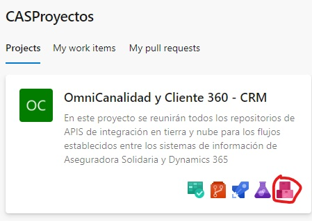

# Template Solidaria

Este template es para crear una aplicación con una arquitectura limpia. El template está diseñado para los servicios backend de Aseguradora Solidaria.

## Estructura del Proyecto

El proyecto se divide en varias capas, cada una con su propio propósito:

- `src\Application`: Contiene la lógica de la aplicación y coordina las interacciones entre las otras capas.
- `src\Domain`: Contiene la lógica de negocio y las entidades del dominio.
- `src\Infrastructure`: Contiene la lógica para interactuar con recursos externos, como bases de datos y servicios web.

Cada capa tiene su propio proyecto en la solución:

- `Application.Host`: Este es el proyecto principal que ejecuta la aplicación.
- `Domain.Model`: Este proyecto contiene las entidades del dominio.
- `Domain.UseCase`: Este proyecto contiene la lógica de negocio.
- `Infrastructure.EntryPoints`: Este proyecto contiene los puntos de entrada a la aplicación, como controladores web.
- `Infrastructure.DrivenAdapters`: Este proyecto contiene adaptadores para interactuar con recursos externos.

## Instalacion el template 

Es necesario configurar las fuentes de los paquetes para poder descargarlos de Azure Artifacts. Para ello es necesario 




```

Template
├── Directory.Build.props
├── Directory.Packages.props
├── README.md
├── TemplateSolidaria.nuspec
├── TemplateSolidaria.sln
└── src
    ├── Application
    │   └── Application.Host
    │       ├── Application.Host.csproj
    │       ├── Dockerfile
    │       ├── Program.cs
    │       ├── Properties
    │       │   └── launchSettings.json
    │       ├── appsettings.Development.json
    │       └── appsettings.json
    ├── Domain
    │   ├── Domain.Model
    │   │   └── Domain.Model.csproj
    │   └── Domain.UseCase
    │       └── Domain.UseCase.csproj
    ├── Infrastructure
    │   ├── DrivenAdapters
    │   │   └── DrivenAdapter.SqlServer
    │   │       └── DrivenAdapter.SqlServer.csproj
    │   └── EntryPoints
    │       └── EntryPoint.Web
    │           ├── Controllers
    │           │   └── Example.cs
    │           └── EntryPoint.Web.csproj
    └── Test
        └── TestProject1
            ├── TestProject1.csproj
            ├── UnitTest1.cs
            └── Usings.cs

15 directories, 19 files

```
